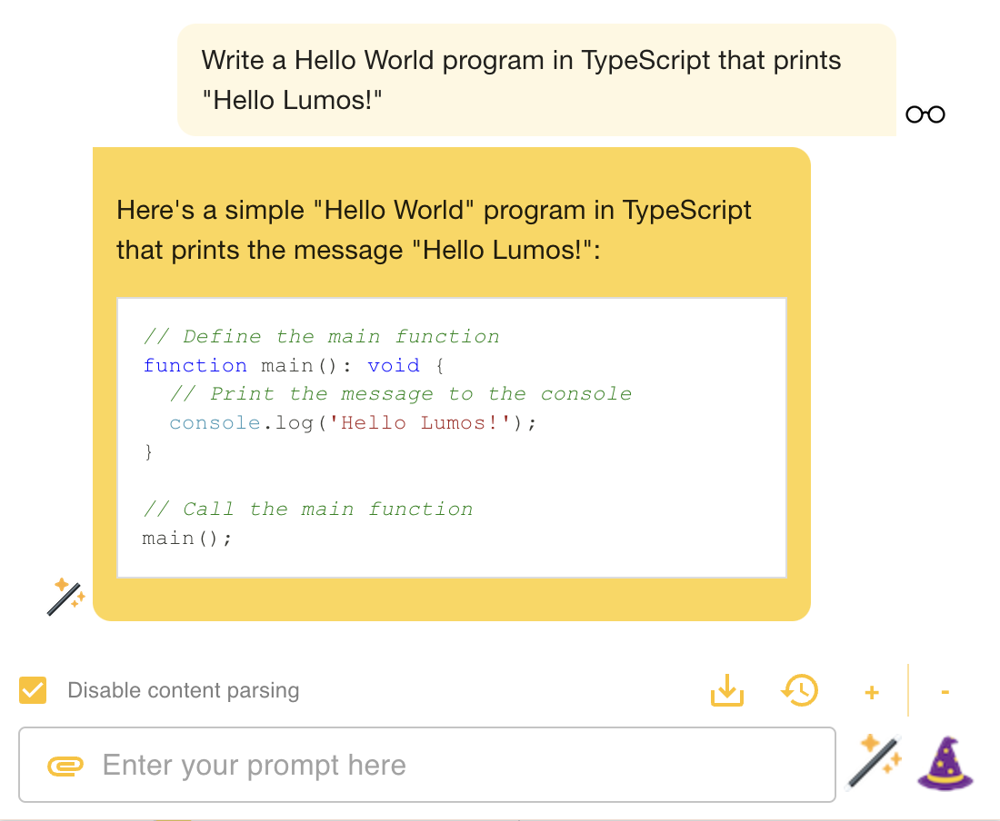

# Lumos

[](https://github.com/andrewnguonly/Lumos/actions/workflows/ci.yml)

A RAG LLM co-pilot for browsing the web, powered by local LLMs.



This Chrome extension is powered by [Ollama](https://ollama.ai/). Inference is done on your local machine without any _external_ server support. However, due to security constraints in the Chrome extension platform, the app does rely on _local_ server support to run the LLM. This app is inspired by the [Chrome extension example](https://github.com/mlc-ai/web-llm/tree/main/examples/chrome-extension) provided by the [Web LLM project](https://webllm.mlc.ai/) and the [local LLM examples](https://js.langchain.com/docs/use_cases/question_answering/local_retrieval_qa) provided by [LangChain](https://github.com/langchain-ai/langchainjs).

- [Ollama (Home)](https://ollama.ai/)
- [Ollama (GitHub)](https://github.com/jmorganca/ollama)

_Lumos. Nox. Lumos. Nox._

## Use Cases
- Summarize long threads on issue tracking sites, forums, and social media sites.
- Summarize news articles.
- Ask questions about reviews on business and product pages.
- Ask questions about long, technical documentation.
- ... what else?

## Ollama Server

A local Ollama server is needed for the embedding database and LLM inference. Download and install Ollama and the CLI [here](https://ollama.ai/).

### Pull Image

Example:
```
ollama pull llama2
```

### Start Server

Example:
```
OLLAMA_ORIGINS=chrome-extension://* ollama serve
```

Terminal output:
```
2023/11/19 20:55:16 images.go:799: total blobs: 6
2023/11/19 20:55:16 images.go:806: total unused blobs removed: 0
2023/11/19 20:55:16 routes.go:777: Listening on 127.0.0.1:11434 (version 0.1.10)
```

Note: The environment variable `OLLAMA_ORIGINS` must be set to `chrome-extension://*` to allow requests originating from the Chrome extension. The following error will occur in the Chrome extension if `OLLAMA_ORIGINS` is not set properly.
```
Access to fetch at 'http://localhost:11434/api/tags' from origin 'chrome-extension://<extension_id>' has been blocked by CORS policy: No 'Access-Control-Allow-Origin' header is present on the requested resource. If an opaque response serves your needs, set the request's mode to 'no-cors' to fetch the resource with CORS disabled.
```

### Docker

The Ollama server can also be [run in a Docker container](https://hub.docker.com/r/ollama/ollama). The container should have the `OLLAMA_ORIGINS` environment variable set to `chrome-extension://*`.

Run `docker run` with the `-e` flag to set the `OLLAMA_ORIGINS` environment variable:
```
docker run -e OLLAMA_ORIGINS="chrome-extension://*" -d -v ollama:/root/.ollama -p 11434:11434 --name ollama ollama/ollama
```

## Chrome Extension

In the project directory, you can run:

### `npm test`

Launches the test runner in the interactive watch mode.\
See the section about [running tests](https://facebook.github.io/create-react-app/docs/running-tests) for more information.

### `npm run lint`

Runs `eslint` and `prettier` on `src` files.

### `npm run build`

Builds the app for production to the `dist` folder.\
It correctly bundles React in production mode and optimizes the build for the best performance.

The build is minified and the filenames include the hashes.\
Your app is ready to be deployed!

See the section about [deployment](https://facebook.github.io/create-react-app/docs/deployment) for more information.

### Load Unpacked Extension (Install)

https://developer.chrome.com/docs/extensions/mv3/getstarted/development-basics/#load-unpacked

### Keyboard Shortcut

Create a keyboard shortcut to make Lumos easily accessible.

1. Navigate to `chrome://extensions/shortcuts`.
1. Configure a shortcut for Lumos (`Activate the extension`). For example, `⌘L` (`command key` + `L`).

### Releases

If you don't have `npm` installed, you can download the pre-built extension package from the [Releases](https://github.com/andrewnguonly/Lumos/releases) page.

## Lumos Options

Right-click on the extension icon and select `Options` to access the extension's [Options page](https://developer.chrome.com/docs/extensions/develop/ui/options-page).

- **Ollama Model**: Select desired model (e.g. `llama2`)
- **Ollama Embedding Model**: Select desired embedding model (e.g. `nomic-embed-text`). **Caution**: Using a different embedding model requires Ollama to swap models, which may incur undesired latency in the app. This is a known limitation in Ollama and may be improved in the future.
- **Ollama Host**: Select desired host (defaults to `http://localhost:11434`)
- **Vector Store TTL (minutes)**: Number of minutes to store a URL's content in the vector store cache.
- **Content Parser Config**: Lumos's default content parser will extract all text content between a page's `<body></body>` tag. To customize the content parser, add an entry to the configuration.
- **Enable/Disable Tools**: Enable or disable individual tools. If a tool is enabled, a custom prefix trigger (e.g. "calc:") can be specified to override the app's internal prompt classification mechanism.
- **Enable/Disable Dark Arts**: 😈

### Content Parser Config

Each URL path can have its own content parser. The content parser config for the longest URL path will be matched.

- **chunkSize**: Number of characters to chunk page content into for indexing into RAG vectorstore
- **chunkOverlap**: Number of characters to overlap in chunks for indexing into RAG vectorstore
- **selectors**: `document.querySelector()` queries to perform to retrieve page content
- **selectorsAll**: `document.querySelectorAll()` queries to perform to retrieve page content

For example, given the following config, if the URL path of the current tab is `domain.com/path1/subpath1/subsubpath1`, then the config for `domain.com/path1/subpath1` will be used (i.e. `chunkSize=600`).

```json
{
  "domain.com/path1/subpath1": {
    "chunkSize": 600,
    "chunkOverlap": 200,
    "selectors": [
      "#id"
    ],
    "selectorsAll": []
  },
  "domain.com/path1": {
    "chunkSize": 500,
    "chunkOverlap": 0,
    "selectors": [
      ".className"
    ],
    "selectorsAll": []
  }
}
```

See docs for [How to Create a Custom Content Parser](./docs/content_parser.md). See documentation for [`querySelector()`](https://developer.mozilla.org/en-US/docs/Web/API/Document/querySelector) and [`querySelectorAll()`](https://developer.mozilla.org/en-US/docs/Web/API/Document/querySelectorAll) to confirm all querying capabilities.

Example:
```json
{
  "default": {
    "chunkSize": 500,
    "chunkOverlap": 0,
    "selectors": [
      "body"
    ],
    "selectorsAll": []
  },
  "medium.com": {
    "chunkSize": 500,
    "chunkOverlap": 0,
    "selectors": [
      "article"
    ],
    "selectorsAll": []
  },
  "reddit.com": {
    "chunkSize": 500,
    "chunkOverlap": 0,
    "selectors": [],
    "selectorsAll": [
      "shreddit-comment"
    ]
  },
  "stackoverflow.com": {
    "chunkSize": 500,
    "chunkOverlap": 0,
    "selectors": [
      "#question-header",
      "#mainbar"
    ],
    "selectorsAll": []
  },
  "wikipedia.org": {
    "chunkSize": 2000,
    "chunkOverlap": 500,
    "selectors": [
      "#bodyContent"
    ],
    "selectorsAll": []
  },
  "yelp.com": {
    "chunkSize": 500,
    "chunkOverlap": 0,
    "selectors": [
      "#location-and-hours",
      "#reviews"
    ],
    "selectorsAll": []
  }
}
```
### Highlighted Content

Alternatively, if content is highlighted on a page (e.g. highlighted text), that content will be parsed instead of the content produced from the content parser configuration.

Note: Content that is highlighted will not be cached in the vector store cache. Each subsequent prompt containing highlighted content will generate new embeddings.

## Shortcuts

- `cmd + c`: Copy last message to clipboard.
- `cmd + j`: Toggle `Disable content parsing` checkbox.
- `cmd + k`: Clear all messages.
- `cmd + ;`: Open/close Chat History panel.
- `ctrl + c`: Cancel request (LLM request/streaming or embeddings generation)
- `ctrl + x`: Remove file attachment.

## Multimodal

Lumos supports multimodal models! Images that are present on the current page will be downloaded and bound to the model for prompting. See documentation and examples [here](./docs/multimodal.md).

## File Attachments

File attachments can be uploaded to Lumos. The contents of a file will be parsed and processed through Lumos's RAG workflow (similar to processing page content). By default, the text content of a file will be parsed if the extension type is not explicitly listed below.

Supported extension types:
- `.csv`
- `.json`
- `.pdf`
- any plain text file format (`.txt`, `.md`, `.py`, etc)

Note: If an attachment is present, page content will not be parsed. Remove the file attachment to resume parsing page content.

### Image Files

Image files will be processed through Lumos's [multimodal workflow](./docs/multimodal.md) (requires multimodal model).

Supported image types:
- `.jpeg`, `.jpg`
- `.png`

## Tools (Experimental)

Lumos invokes [Tools](https://js.langchain.com/docs/modules/agents/tools/) automatically based on the provided prompt. See documentation and examples [here](./docs/tools.md).

## Reading
- [Local LLM in the Browser Powered by Ollama](https://medium.com/@andrewnguonly/local-llm-in-the-browser-powered-by-ollama-236817f335da)
- [Local LLM in the Browser Powered by Ollama (Part 2)](https://medium.com/@andrewnguonly/local-llm-in-the-browser-powered-by-ollama-part-2-6eb10caf39a1)
- [Let’s Normalize Online, In-Memory RAG! (Part 3)](https://medium.com/@andrewnguonly/lets-normalize-online-in-memory-rag-88e8169e9806)
- [Supercharging If-Statements With Prompt Classification Using Ollama and LangChain (Part 4)](https://blog.langchain.dev/supercharging-if-statements-with-prompt-classification-using-ollama-and-langchain/)
- [Bolstering LangChain’s MemoryVectorStore With Keyword Search (Part 5)](https://medium.com/@andrewnguonly/bolstering-langchains-memoryvectorstore-with-keyword-search-3d35cc278dc1)
