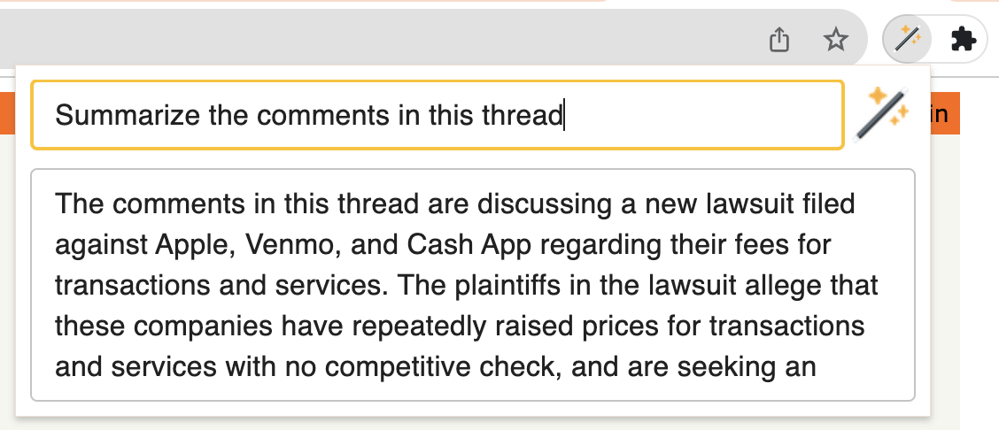

# Lumos

A RAG LLM co-pilot for browsing the web, powered by local LLMs.



This Chrome extension is powered by [Ollama](https://ollama.ai/). Inference is done on your local machine without any _external_ server support. However, due to security constraints in the Chrome extension platform, the app does rely on _local_ server support to run the LLM. This app is inspired by the [Chrome extension example](https://github.com/mlc-ai/web-llm/tree/main/examples/chrome-extension) provided by the [Web LLM project](https://webllm.mlc.ai/) and the [local LLM examples](https://js.langchain.com/docs/use_cases/question_answering/local_retrieval_qa) provided by LangChain.

- [Ollama (Home)](https://ollama.ai/)
- [Ollama (GitHub)](https://github.com/jmorganca/ollama)

_Lumos. Nox. Lumos. Nox._

## Ollama Server

A local Ollama server is needed for the embedding database. Download and install Ollama and the CLI [here](https://ollama.ai/).

### Pull Model

`llama2` model is required. The implementation of Lumos is [hardcoded](https://github.com/andrewnguonly/Lumos/blob/main/src/scripts/background.ts#L12) to use `llama2`.
```
ollama pull llama2
```

### Start Server

Example:
```
OLLAMA_ORIGINS=chrome-extension://* ollama serve
```

Terminal output:
```
2023/11/19 20:55:16 images.go:799: total blobs: 6
2023/11/19 20:55:16 images.go:806: total unused blobs removed: 0
2023/11/19 20:55:16 routes.go:777: Listening on 127.0.0.1:11434 (version 0.1.10)
```

Note: The environment variable `OLLAMA_ORIGINS` must be set to `chrome-extension://*` to allow requests originating from the Chrome extension.

## Chrome Extension

In the project directory, you can run:

### `npm test`

Launches the test runner in the interactive watch mode.\
See the section about [running tests](https://facebook.github.io/create-react-app/docs/running-tests) for more information.

### `npm run build`

Builds the app for production to the `dist` folder.\
It correctly bundles React in production mode and optimizes the build for the best performance.

The build is minified and the filenames include the hashes.\
Your app is ready to be deployed!

See the section about [deployment](https://facebook.github.io/create-react-app/docs/deployment) for more information.

### Load Unpacked Extension (Install)

https://developer.chrome.com/docs/extensions/mv3/getstarted/development-basics/#load-unpacked

## Use Cases
- Summarize long threads on issue tracking sites, forums, and social media sites.
- Summarize news articles.
- Ask questions about reviews on business and product pages.
- Ask questions about long, technical documentation.
- ... what else?
