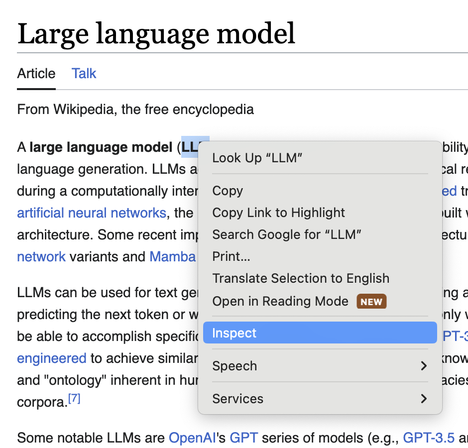
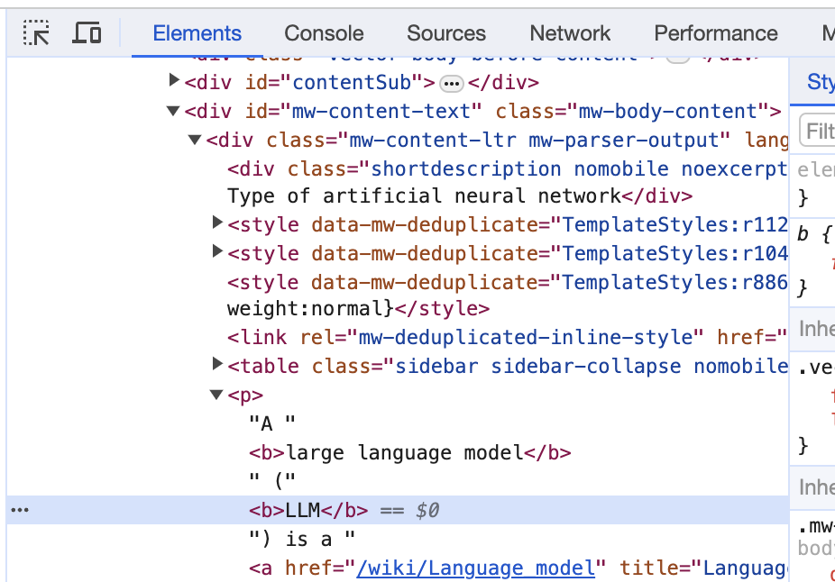

# How to Create a Custom Content Parser

Admittedly, creating a custom content parser is a bit cumbersome. However, once it's configured, it shouldn't change frequently.

## Inspect the DOM

Right-click on any part of the page and select "Inspect" to open the "Elements" tab of the Chrome Developer Tools.




## Find the Containing `<div>`

An effective approach is to find the innermost (or outermost depending on your use case) containing `<div>` of the selected element that has a unique `id` or `class` that can be used to distinguish the container.

Note: The container tag doesn't necessarily have to be a `<div>` tag. It can be any tag.

## Determine Selector Query

Determine the selector (and selectorAll) queries and add them to the existing content parser configuration in the Lumos Options page. See documentation for [`querySelector()`](https://developer.mozilla.org/en-US/docs/Web/API/Document/querySelector) and [`querySelectorAll()`](https://developer.mozilla.org/en-US/docs/Web/API/Document/querySelectorAll) to confirm all querying capabilities and see more examples.

Example queries:
1. Select element by tag name: `tagName`
1. Select element by id (leading `#`): `#elementId` 
1. Select element by class name (leading `.`): `.className`

`querySelector()` supports [complex selectors](https://developer.mozilla.org/en-US/docs/Web/API/Document/querySelector#complex_selectors) and [negation](https://developer.mozilla.org/en-US/docs/Web/API/Document/querySelector#negation).

Example config for a single domain:
```json
{
  "domain.com": {
    "chunkSize": 500,
    "chunkOverlap": 0,
    "selectors": [
      "tagName",
      "#elementId"
    ],
    "selectorsAll": [
      ".className"
    ]
  }
}
```
