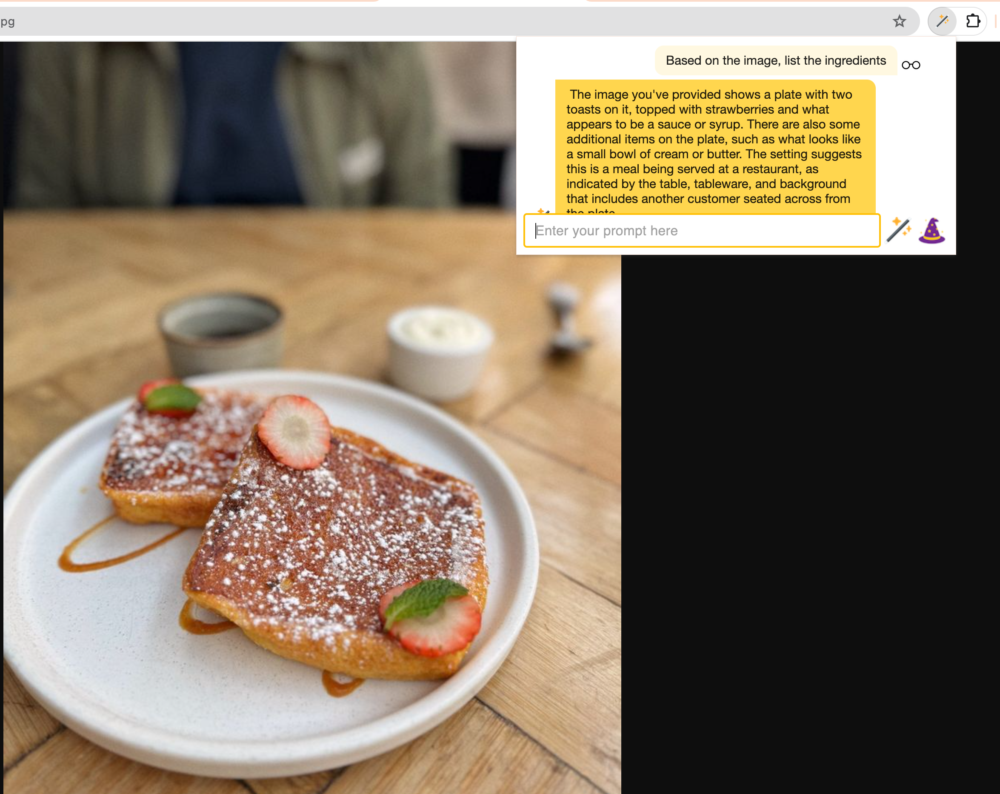

# Multimodal Models

[LLaVA](https://ollama.ai/library/llava) and [BakLLaVA](https://ollama.ai/library/bakllava) are multimodal models available through Ollama. Select a multimodal model from the Lumos Options page and prompt away!

Note: Some webpages contain many images. It may be preferable to open individual images in a separate tab to reduce the amount of images bound to the model. In the future, optimizations may be made to improve the user experience. At the moment, only 10 images are bound to the model for processing at a time.

## Prompting Tip

Prefix the prompt with the text "Based on the image". This prefix will override Lumos's internal prompt classification mechanism.

Examples
1. "Based on the image, describe the background"
1. "Based on the image, count how many dogs are in the photo"

## Examples

**_What's for dinner?_**

**_More food..._**

**_Cool picture_**

