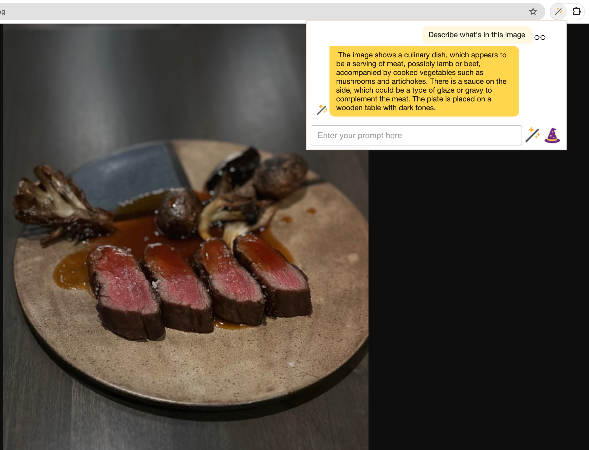
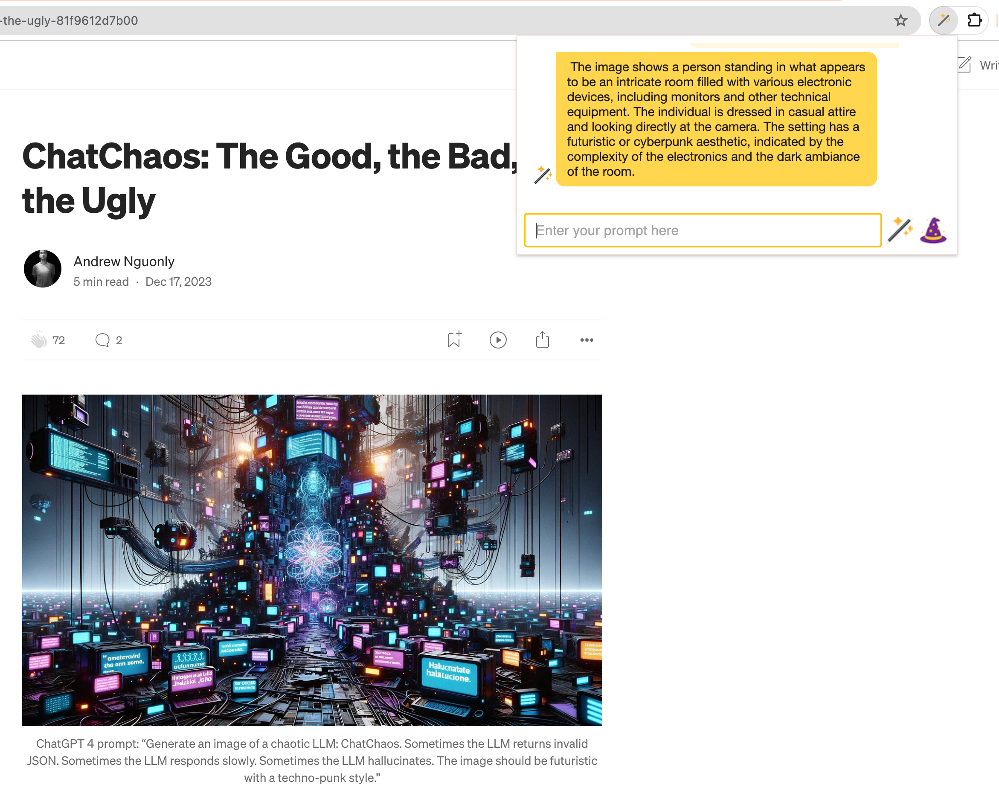

# Multimodal Models

[LLaVA](https://ollama.ai/library/llava) and [BakLLaVA](https://ollama.ai/library/bakllava) are multimodal models available through Ollama. Select a multimodal model from the Lumos Options page and prompt away!

Note: Some webpages may contain many images. It may be preferable to open individual images in a separate tab to reduce the amount of images being processed by the model. In the future, UI/UX optimizations may be made to improve the user experience.

_What's for dinner?_

_Cool picture_

