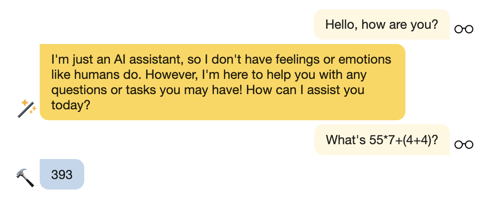

# Tools (Experimental)

The integration of [LangChain Tools](https://js.langchain.com/docs/modules/agents/tools/) into Lumos is an experimental feature. Lumos is not an [Agent](https://js.langchain.com/docs/modules/agents/) per se. However, the implementation automatically invokes tools when appropriate.

Messages from tools will be in light blue with a hammer avatar.

## Calculator

The `Calculator` tool evaluates arithmetic expressions. For example, the prompt `What's 45*6+7=?` will return `277`. To manually trigger, the `Calculator` tool, prefix the prompt with `calculate:` (e.g. `calculate: 1+1`).

Not all arithmetic expressions are supported. In some cases, unsupported expressions may produce a false positive result. The implementation of the tool has a "loose" approach towards parsing expressions. This means that non-arithmetic characters (e.g. letters, symbols) are accepted as part of the expression, but are parsed out and ignored. This may result in a valid arithmetic expression, but an unintended one that produces a false positive result. A "loose" approach is favored over a "strict" approach to allow expressions that may contain conversational context (e.g. `"What's 1+1?"`), whitespace (e.g. `"2 + 2"`), and the trigger prefix (`calculate:`). In the future, the implementation for parsing expression may become more strict.

**Warning: Double-check all calculations.**
